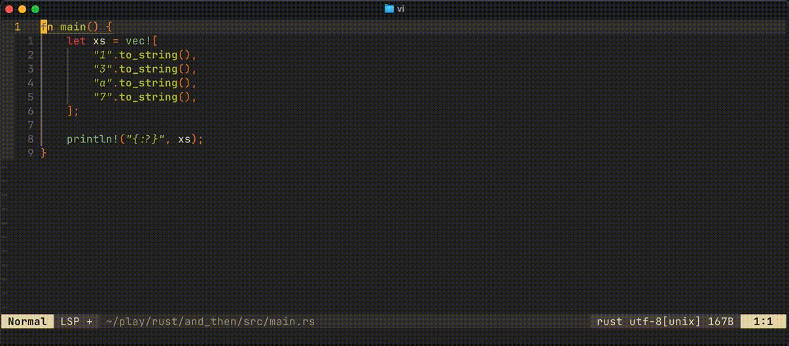

# telescope_grep_history

A simple Neovim plugin providing persistent, project-aware history for Telescope's content grep pickers (`live_grep`, `grep_string`), allowing you to quickly cycle through previous searches using `<Tab>`. Avoid retyping common or complex search terms!

## Features

*   Remembers previous searches from Telescope's `live_grep` and `grep_string` pickers.
*   Cycle through history  backwards using `<Tab>` in the Telescope prompt (Oldest -> Newest -> Wrap).
*   Either **Project Scope:** to automatically keep separate history lists for different projects **or Global Scope:** to use a single shared history list across all projects (configurable either way).
*   Configurable limit on the number of history entries stored.
*   Automatically saves the current search query when confirming a search (when you press via <CR> in the picker).



## Requirements

*   Neovim >= 0.7.0 (Recommended: Latest stable)
*   [telescope.nvim](https://github.com/nvim-telescope/telescope.nvim)
*   [plenary.nvim](https://github.com/nvim-lua/plenary.nvim) (Telescope dependency)

## Installation

Use your preferred plugin manager.

**lazy.nvim**

1. Add the plugin specification for `telescope_grep_history` to your plugin list (e.g., in `lua/custom/plugins/telescope_grep_history.lua` or alongside your other plugins):

```lua
return {
  "marktelescope/telescope_grep_history",
  -- Optional: Add dependencies if this plugin had any *direct* ones
  -- dependencies = { "nvim-lua/plenary.nvim" }, -- Example if needed, but plenary is likely via telescope
}
```

2. Ensure `telescope.nvim` lists `telescope_grep_history` as a dependency in its *separate* specification, **as shown in the Setup / Configuration section below**.

**packer.nvim**

```lua
use {
  'marktelescope/telescope_grep_history',
  requires = { 'nvim-telescope/telescope.nvim' } -- Ensure Telescope is available
}
```

-- Configuration requires modifying your existing Telescope setup (see below).

## Setup / Configuration

Configuration involves **two steps** within your existing `telescope.nvim` setup:

1.  **Add `telescope_grep_history` as a dependency** to your `telescope.nvim` plugin specification.
2.  **Call `require('telescope_grep_history').setup()`** and **apply the returned mappings** *inside* the `config` function of your `telescope.nvim` specification.

**Step 1, 2a & 2b. (Example for `telescope.nvim` kickstart / lazy.nvim setup):**

```lua
-- In your lua/plugins/telescope.lua (or equivalent file containing Telescope setup)
return {
  'nvim-telescope/telescope.nvim',
  -- tag = '0.1.x',
  dependencies = {
    'nvim-lua/plenary.nvim',
    'marktelescope/telescope_grep_history', -- <<< STEP 1: Add as dependency
    -- Your other Telescope dependencies...
  },
  config = function()
    local telescope = require('telescope')
    local builtin = require('telescope.builtin')

    -- STEP 2a: Call the history plugin's setup function
    local grep_history = require('telescope_grep_history').setup({
      -- Configure options here (see below)
      -- history_scope = "project",
      -- history_limit = 50,
    })

    -- STEP 2b: Modify pickers in telescope.setup() to attach the mappings
    telescope.setup {
      defaults = {
        -- Your Telescope defaults...
      },
      pickers = {
        live_grep = {
          -- Your other live_grep options...
          attach_mappings = grep_history.attach_mappings, -- <<< Apply here
        },
        grep_string = {
          -- Your other grep_string options...
          attach_mappings = grep_history.attach_mappings, -- <<< Apply here
        },
        -- Other pickers... (Do NOT add attach_mappings here)
      },
      extensions = {
        -- Your extensions...
      },
    }

    -- Your Telescope keymaps remain unchanged (these are just examples of what you might have)
    vim.keymap.set('n', '<leader>sg', builtin.live_grep, { desc = '[S]earch [G]rep' })
    vim.keymap.set('n', '<leader>sw', builtin.grep_string, { desc = '[S]earch [W]ord' })
    -- Other keymaps...
  end,
}
```

---

**Configuration Options for `telescope_grep_history.setup()`:**

These options are passed inside the `require('telescope_grep_history').setup({...})` call shown in Step 2a above.

*   **`history_scope`**: (String, Default: `"project"`) Determines where history is stored.
    *   `"project"`: Separate history file per project root (based on markers). Falls back to global if no root found.
    *   `"global"`: Single global history file for all sessions/projects.
*   **`history_limit`**: (Number, Default: `10`) Maximum number of history entries to keep per list (project or global).
*   **`project_markers`**: (Table, Default: `{ ".git", ".svn", ... }`) Files/directories that mark the root of a project when `history_scope = "project"`.
*   **`history_dir`**: (String, Default: `vim.fn.stdpath('data') .. '/telescope_grep_history'`) Base directory where project-specific history files are stored.
*   **`global_history_file`**: (String, Default: `vim.fn.stdpath('data') .. '/telescope_grep_global_history.txt'`) Path to the single history file used when `history_scope = "global"` or as a fallback.
*   **`use_plenary_path`**: (Boolean, Default: Auto-detected) Set to `false` if plenary.nvim is not available (not recommended, uses simpler fallback logic for paths/directories).

---

**Recap: Why Manual picker `attach_mappings`?**

This plugin requires manually adding `attach_mappings = grep_history.attach_mappings` to the `live_grep` and `grep_string` pickers inside `telescope.setup`. This manual step ensures robustness and avoids potential conflicts with Telescope updates or other plugins trying to modify Telescope's configuration automatically.

## Usage

1.  Install and configure the plugin as shown above, ensuring you add `attach_mappings = grep_history.attach_mappings` to **both** the `live_grep` and `grep_string` sections of your `telescope.setup`.
2.  Open `live_grep` or `grep_string` (e.g., using your mapped keys).
3.  Type a search query.
4.  Press `<CR>` (saves the query to history)
5.  Open `live_grep` or `grep_string` again and save a few more queries.
6.  Open `live_grep` or `grep_string` yet again.
6.  While the prompt is focused, press `<Tab>` to cycle backwards through your previous searches.
7.  Press `<CR>` to perform the search on a selected an item.

## Troubleshooting

*   **TBD**

## License

This plugin is licensed under the MIT License. See the [LICENSE](LICENSE) file for details.
